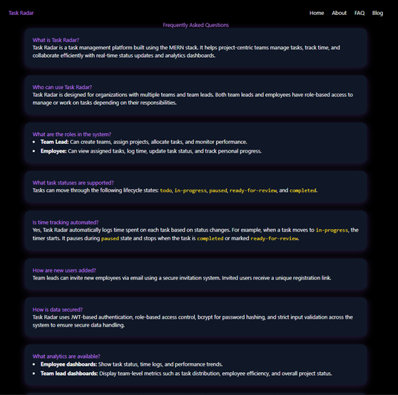

# TaskRadar - From Workforce to Worth Force with TaskRadar

**TaskRadar** is a robust, full-stack project management system designed to streamline project planning, task assignment, progress tracking, and performance analytics for teams and organizations. With secure authentication, role-based access, real-time dashboards, and interactive analytics, TaskRadar empowers both administrators and employees to collaborate efficiently and achieve project goals.

---

## Features

- **User Authentication**: Secure registration and login with JWT, bcrypt, and role-based access (Admin/Employee).
- **Project Management**: Create, update, assign, and track projects with status management.
- **Task Management**: Assign tasks to employees, set priorities and deadlines, track progress, and log time.
- **Dashboards & Analytics**: Real-time, interactive dashboards for admins and employees with detailed charts and statistics.
- **Employee Management**: Admins can view, add, and manage employee assignments and performance.
- **File Uploads**: Upload and manage user avatars using Cloudinary.
- **Responsive Design**: Modern frontend with support for all devices.

---

## Feature Preview

### 1. Landing Page


### 2. NavBar Info Pages


### 3. Admin Dashboard


### 4. Project Analytics Overview


### 5. Project Creation


### 6. Particular Project Dashboard


### 7. Particular Project Analytics


### 8. Task Creation


### 9. Employee Dashboard


### 10. Employee Analytics


---

## Statuses and Priorities

### Project Statuses
- `ongoing` — The project is currently in progress.
- `completed` — The project has been finished.

### Task Statuses
- `todo` — Task is yet to be started.
- `in-progress` — Task is currently being worked on.
- `paused` — Work on the task is temporarily halted.
- `resume` — Task has resumed after being paused.
- `ready-for-review` — Task is completed and pending review.
- `completed` — Task is finished.

### Task Priorities
- `low`
- `medium`
- `high`
- `critical`

### Pause Reasons for Tasks
- `system error`
- `break`
- `shift ended`
- `meeting`
- `null` (no specific reason)

---

## Time Calculation for Each Task

Task time tracking is a core feature of TaskRadar:

- Each task maintains a `timeLogs` array, where each log includes a `start` and `end` timestamp, and an optional `pauseReason`.
- Total time spent on a task is automatically calculated as the sum of all `(end - start)` intervals.
- When a task is paused, the current time log ends, and the pause reason is recorded.
- When resumed, a new time log is started.
- The `totalTimeSpent` field reflects the cumulative active work time, excluding paused intervals.

---

## Tech Stack

- **Frontend**: React.js / Vue.js, HTML5, CSS3, JavaScript, Chart.js or D3.js
- **Backend**: Node.js, Express.js, Mongoose, Multer, JWT, bcrypt, dotenv
- **Database**: MongoDB
- **Dev Tools**: Visual Studio Code, Nodemon, Postman

---

## Getting Started

### Prerequisites

- Node.js and npm
- MongoDB (local or cloud)
- Cloudinary account (for avatar uploads)

### Installation

Backend And Frontend
```bash
git clone https://github.com/yourusername/TaskRadar.git
cd TaskRadar\task_radar\client
npm install
cd ..
cd TaskRadar\task_radar\server
npm install
```
### Start the backend server and frontend:
```bash
npm run dev
```

## Usage

- Register as an **Admin** or **Employee**.
- **Admins** can create projects, assign tasks, manage employees, and view analytics.
- **Employees** can view and update their assigned tasks, manage their profile, and track work time.
- Both roles have access to personalized dashboards and real-time project analytics.

---

## Users

- **Admin**:  
  Full access to all features, including project creation, task assignment, employee management, analytics, and dashboards.

- **Employee**:  
  Access to assigned projects and tasks, personal dashboard, task status updates, and performance insights.

---

## Contributing

We welcome contributions from the community!  
To contribute:
1. Fork the repository
2. Create a new branch for your feature or fix
3. Submit a pull request with a clear description of your changes

---

## Contact

For support, feature requests, or questions, feel free to reach out:  
📧 **zpatel044@example.com**

---

**TaskRadar** — Keep your projects and tasks on the radar, always!


